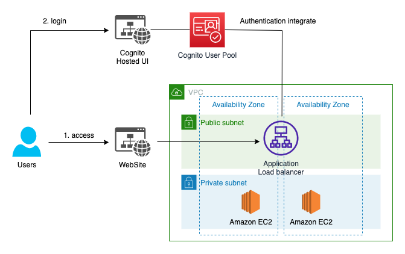
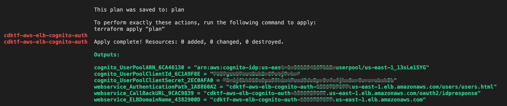
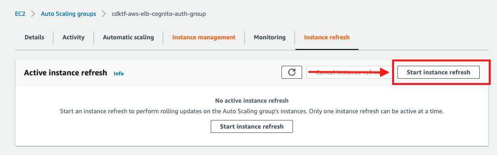
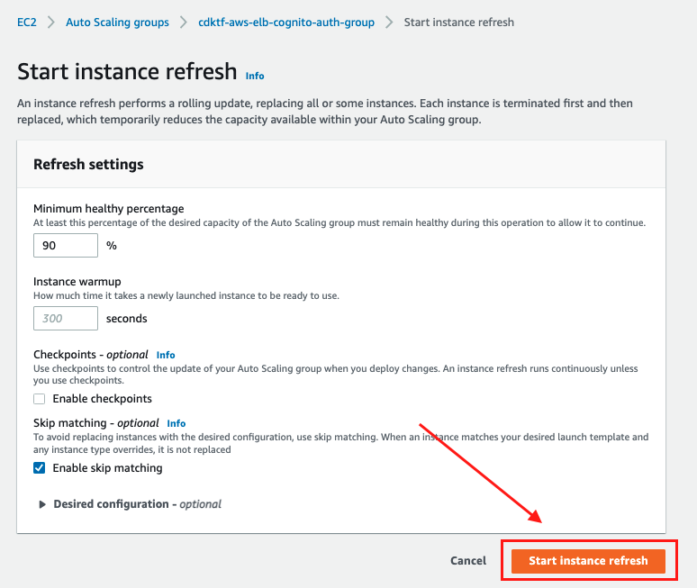
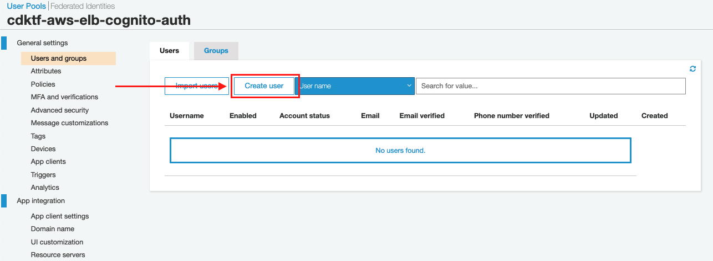
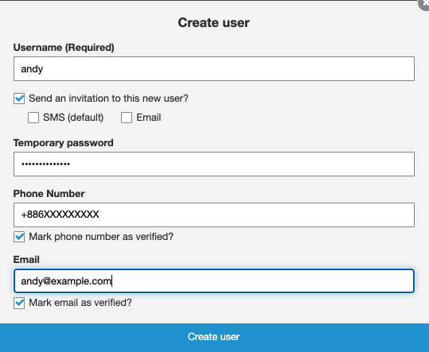
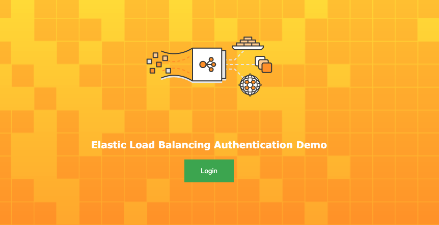
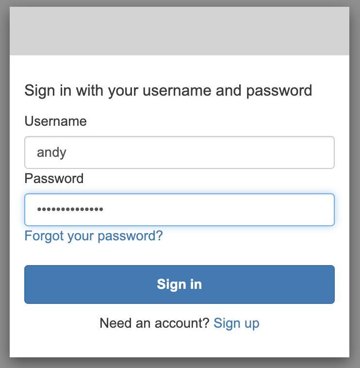
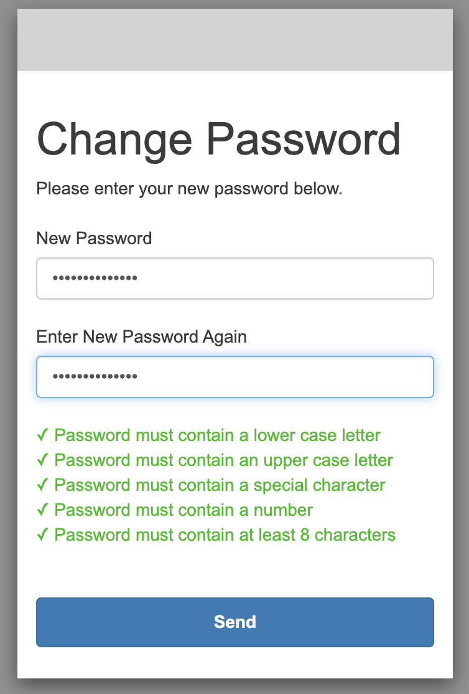

# Build a Website Login page with AWS ELB and AWS Cognito using Terraform CDK

This repository describes how to integrate Amazon Cognito User Pool(OAuth 2.0 Client credentials grant) and Application Load balancer(Cognito Authorizer) using Terraform CDK. This sample is applicable to a usecase for user login authentication. All resources and configuration is provided through Terraform CDK(typescript codes).

## Overview

You call build a website with a simple Login button. This repository will create an AWS ALB that is configured authentication using Cognito user pool.

## Architecture



## Prerequisites

If you haven't already done so you must first:

- [Install Terraform and CDKTF](https://learn.hashicorp.com/tutorials/terraform/cdktf-install), in order to use CDKTF, you need:
    - The [Terraform CLI](https://learn.hashicorp.com/tutorials/terraform/install-cli) (1.1+).
    - [Node.js](https://nodejs.org/) and npm v16+.
- Generate an [ACM Certificate](https://docs.aws.amazon.com/acm/latest/userguide/acm-overview.html) that will be used to secure communication between the browser and ALB using HTTPS. (AWS Cognito required ALB with HTTPS listener.)
- A Full Qualified Domain Name (FQDN) to custom domain name to your ALB (If you are just testing, this is optional)
- [Amazon VPC with Public and Private Subnets (NAT)](https://docs.aws.amazon.com/vpc/latest/userguide/VPC_Scenario2.html).

## Create and initialize

Start to install for Terraform CDK and Node.js

```
$ cdktf get
Generated typescript constructs in the output directory: .gen

$ npm install
```

## Setup the configuration file

The stack requires set up `config.json` configuration. 

```json
{
    "name": "cdktf-aws-elb-cognito-auth",
    "region": "us-east-1",
    "vpcId": "<VPC_ID>",
    "privateSubnetIds": ["<PRIVATE_SUBNET_AZ1_ID>","<PRIVATE_SUBNET_AZ2_ID>"],
    "publicSubnetIds": ["<PUBLIC_SUBNET_AZ1_ID>","<PUBLIC_SUBNET_AZ1_ID>"],
    "webservice": {
        "instanceType": "t3.micro",
        "minSize": 2,
        "maxSize": 4,
        "desiredCapacity": 2,
        "authenticationPath": "/users/*",
        "certificateArn": "arn:aws:acm:us-east-1:<ACCOUNT_ID>****:certificate/8e7d53ff-*****-*****-c932f9df8cb2"
    },
    "cognito": {
        "domain": "<CUSTOM_COGNITO_DOMAIN_NAME>",
        "autoVerifiedAttributes": ["phone_number"],
        "mfaConfiguration": "OFF",
        "oauthFlows": ["code"],
        "oauthScopes": ["openid"],
        "callbackUrls": ["https://temporary.us-east-1.elb.amazonaws.com/oauth2/idpresponse"],
        "passwordPolicy": {
            "minimumLength": 8,
            "requireLowercase": true,
            "requireNumbers": true,
            "requireSymbols": true,
            "requireUppercase": true,
            "temporaryPasswordValidityDays": 7
        },
        "schema": [{
            "name": "email",
            "attributeDataType": "String",
            "developerOnlyAttribute": false,
            "mutable": false,
		    "required": true,
            "stringAttributeConstraints": {
                "maxLength": "2048",
                "minLength": "0"
            }
        }]
    }
}
```

- `webservice.certificateArn` : This is the certificate that ALB will use to secure the communication with your browser. You would need to copy the ARN from the ACM console
- `cognito.domain` : This will be the domain name of the Cognito Hosted UI.
- `cognito.callbackUrls` : You must get the ALB domain name after the first deployment. You can use the temporary name first.

## Deploy Cognito and Website


Now run `cdktf deploy` to complie the code.

```
$ cdktf apply --auto-approve
```



Once deployed, Terraform CDK will pring out the `call back url` and `authentication path` to replace temporary parameter in `config.json` and `user_data.sh`.

- Replace `callbackUrls` from pring out the `webservice_CallBackURL` value

```json
{
    "cognito": {
        "callbackUrls": ["<webservice_CallBackURL>"]
    }
}
```

- Replace the login button with ALB domain name to the `/var/www/html/index.html` in the `user_data.sh` file.

```bash
cat <<EOF > /var/www/html/index.html
    <button class="button" onclick="window.location.href = 'https://<ALB_DOMAIN_NAME>/users/users.html'">Login</button>
EOF
```

Deploy again to update AlB domain name

```
$ cdktf apply --auto-approve
```

Start instance refresh to refresh ALB domain name modify.




## Create login user

Create user in the Users and groups navigation pane on AWS Cognito console.



By defaul, Cognito will send temporary password to SMS.


## Try it

Browse to your ALB Domain name configured for the website : https://<ALB_DOMAIN_NAME>



You will direct to Cognito Hosted UI login page, input username `andy` and temporary password.



The new password will be reset for the first time



Congratulations!! you are successfully authenticated.


## Cleaning up

Run the following command:

```sh
$ cdktf destroy
```

## Security

See [CONTRIBUTING](CONTRIBUTING.md#security-issue-notifications) for more information.

## License

This library is licensed under the MIT-0 License. See the LICENSE file.
